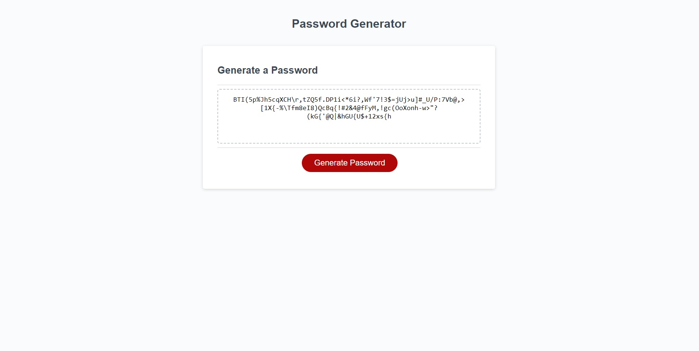

# ChallengeThree
This is Challenge Project 3, Random Password Generator.

##ChallengeThree is a website that creates a randomly generated password based on user selected criteria.

This was the challenge project 3 for the MSU Coding Bootcamp. 
This project introduced the basic functions of Javascript. It utalized functions, arrays, random number generators, variables, for loops, and if statements to randomly generate a password based on the users selected length and chosen set of characters. 

## Installation

No instalation is required.

## Usage

Click the "Generate Password" button and follow the prompts.

## Credits

This was completed with the knowledge gained during the MSU Coding Bootcamp.